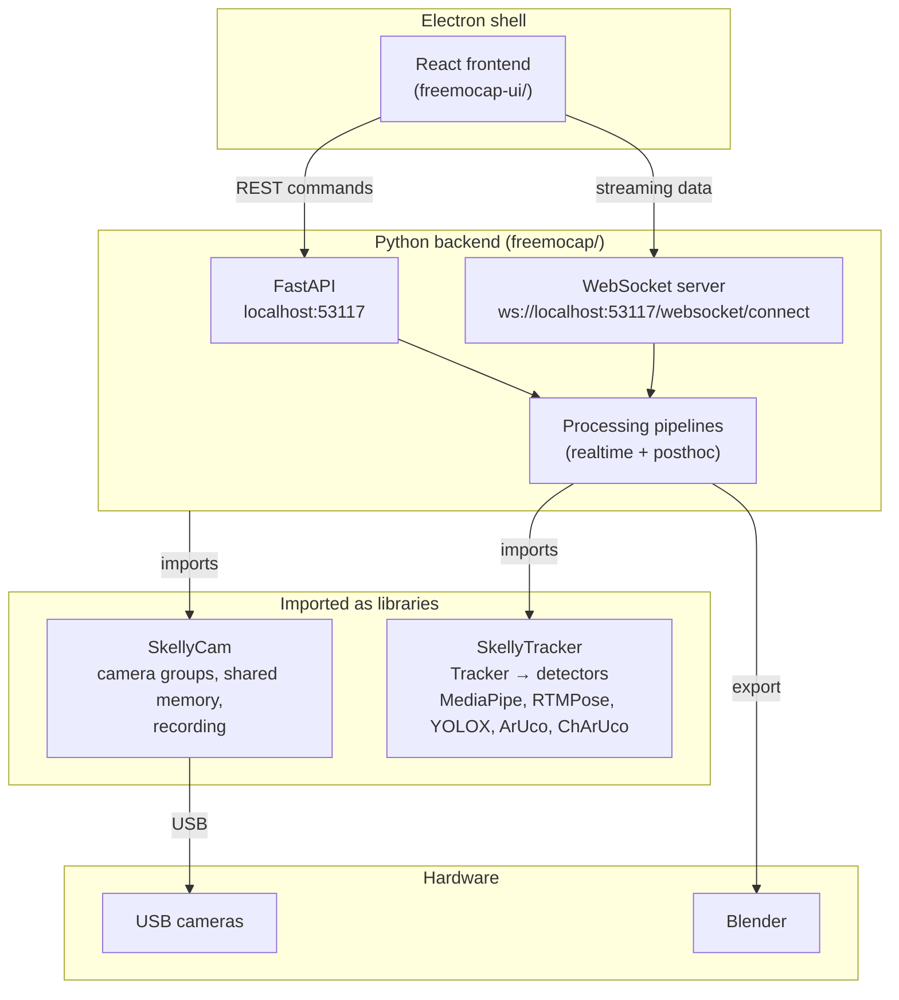

# Architecture overview

FreeMoCap is a markerless motion capture system. An Electron desktop app
wrapping a React UI talks to a local Python backend over REST and websocket.
The backend captures synchronized video from multiple USB cameras, records it,
and processes it into 3D skeleton data.

This page is the orientation layer: what the moving parts are and how they
connect. The pages below zoom into one layer at a time.

## One app, three repos that matter

FreeMoCap is a polyrepo project. Three repositories compose the running app:

| Repo | Owns | How it plugs in |
|---|---|---|
| `freemocap` | The app: React/Electron frontend, FastAPI backend, processing pipelines | This is the composition root. Everything else is a dependency of it. |
| `skellycam` | Cameras: detection, configuration, shared memory ring buffers, synchronized recording to disk, multiprocess worker management | Imported as a Python library by the backend; its HTTP routes are mounted under `/skellycam` on the backend's server |
| `skellytracker` | Pose estimation: the unified `Tracker` API and the detectors (MediaPipe, RTMPose, YOLOX, ArUco, ChArUco), with batched multi-camera inference | Imported as a Python library by the pipeline nodes |

Each of those sibling projects has its own documentation site:
[SkellyCam](https://freemocap.github.io/skellycam/) and
[SkellyTracker](https://freemocap.github.io/skellytracker/).

Other organization repos show up as smaller dependencies rather than
architectural pillars. The backend imports `skellyforge` (skeleton model
definitions, filtering and interpolation used during mocap processing),
streams logs through `skellylogs`, and sends anonymous usage telemetry through
`skellypings`. Blender export runs `freemocap_blender_addon` inside a headless
Blender subprocess, loading the addon straight from the backend's Python
environment, so installing it into Blender itself is optional (and the addon
currently supports MediaPipe-processed recordings only). SkellySync has no
imports in the FreeMoCap backend today.



## Inside the FreeMoCap repo

```
freemocap/
├── freemocap-ui/     React/TypeScript frontend + Electron shell
├── freemocap/        Python backend (FastAPI app, pipelines, pubsub)
├── shared/           Shared assets: ChArUco boards, logo, macOS packaging files
└── freemocap-docs/   The repository's own Docusaurus architecture docs
```

The Python package splits roughly along those same lines:

- `api/` holds the FastAPI app factory, routers, middleware, and the websocket
  server.
- `app/` holds `FreemocapApplication`, the singleton that owns all long-lived
  state.
- `core/` holds the processing pipelines and tasks (calibration, mocap,
  realtime tracking, Blender export).
- `pubsub/` holds the topic-based message bus used between worker processes.

The frontend mirrors this under `src/`: `services/` talks to the backend,
`store/` holds Redux slices, `layout/` and `pages/` hold the UI shell, and an
`electron/` folder holds the main-process code.

## How the layers talk

Two channels connect frontend and backend, both served by the same process on
port 53117 (the port is defined once in `server_constants.py` and mirrored in
the frontend's `server-urls.ts`; the backend prints a port sentinel line so
the Electron launcher can discover it):

- **REST** carries commands: detect cameras, apply camera configs, start and
  stop recording, run calibration, start mocap processing, export to Blender.
  Request, response, done.
- **The websocket** (`/websocket/connect`) carries everything that streams:
  binary JPEG frames per camera, keypoints, log lines, framerate stats, and
  pipeline progress. Clients acknowledge frame numbers to pace the backend.

There is a third channel inside the desktop app only: Electron IPC, bridged
through a tRPC proxy, for things only a native shell can do such as file
dialogs and native menus. The core system works in a plain browser without it.

Deeper detail on these contracts lives in [REST API](/reference/rest-api)
and [websocket API](/reference/websocket-api).

## The backend's center of gravity

The backend is a FastAPI app created by `create_fastapi_app()` in
`app/app.py`. Its route table tells you where each domain lives:

| Group | Prefix | What mounts there |
|---|---|---|
| App routers | (none) | Health check, shutdown |
| FreeMoCap routers | `/freemocap` | realtime pipeline, calibration, mocap, posthoc control, playback, Blender, telemetry |
| SkellyCam routers | `/skellycam` | Camera management, imported directly from the SkellyCam package |

State lives in one place: `FreemocapApplication` (`app/freemocap_application.py`),
created once at startup and fetched anywhere else via `get_freemocap_app()`.
It owns five things:

| Field | Purpose |
|---|---|
| `global_kill_flag` | Shared shutdown signal visible to every child process |
| `worker_registry` | Child process lifecycle and heartbeat monitoring |
| `camera_group_manager` | Camera detection and configuration, from SkellyCam |
| `realtime_pipeline_manager` | Long-lived pipelines bound to live camera groups |
| `posthoc_pipeline_manager` | Fire-and-forget pipelines pointed at recorded videos |

In the same way that SkellyCam's identity is CRUD operations on camera groups,
FreeMoCap's identity is CRUD operations on **pipelines**. A realtime pipeline
attaches processing nodes to a live camera group; a posthoc pipeline reads a
recording folder from disk instead. Everything else the app does (recording
start and stop, serving aggregated payloads to the websocket relay, projecting
state snapshots) hangs off that distinction. If you understand which manager
owns which kind of pipeline, you can find your way around the backend.

At startup the app logs system capabilities (OS, CPU, RAM, detected GPUs via
`nvidia-smi` or platform fallbacks, and ONNX Runtime version and execution
providers) and ensures `~/freemocap_data/` exists. At shutdown it sets
`global_kill_flag`, which cascades through child processes via their
`should_continue` checks.

## Pipelines in one paragraph

Pipelines are graphs of worker processes ("nodes") connected by the topic-based
pubsub system in `pubsub/`. In a realtime pipeline, a per-camera node reads
frames out of SkellyCam's shared memory ring buffer, optionally runs
detection, and publishes results; an aggregator node combines them. In a
posthoc pipeline the frames come from recorded videos instead. Calibration and
mocap are posthoc tasks built on the same machinery. Node topology, phases,
and the IPC details are covered in [Follow one recording end to end](/build/pipeline).

## Design rules worth knowing before reading code

These principles shape decisions throughout the codebase, and knowing them up
front explains a lot of otherwise surprising structure:

- **Depth-stackable complexity.** Newcomer-friendly defaults with full power
  exposed, never hidden. The docs follow the same rule.
- **Fail loudly.** Crash with a clear error rather than degrade silently.
  Exception handling appears at system boundaries: input validation, network
  reconnection, GPU out-of-memory recovery.
- **Single source of truth.** Every config flag and decision has exactly one
  definition. The known exceptions sit at the language boundary (a few
  constants like the port number duplicated between TypeScript and Python),
  and they are documented as exceptions.
- **Zero backwards compatibility, aspirationally.** New code targets the
  current architecture without shims, though some pragmatic legacy support
  remains where recordings must stay usable.

## Where to go next

- [backend architecture](/build/backend) for the FastAPI app, websocket relay,
  calibration, and mocap internals
- [Follow one recording end to end](/build/pipeline)
  to trace data from camera frames to 3D skeletons
- [Data contracts between components](/build/data-contracts) for what crosses
  each boundary
