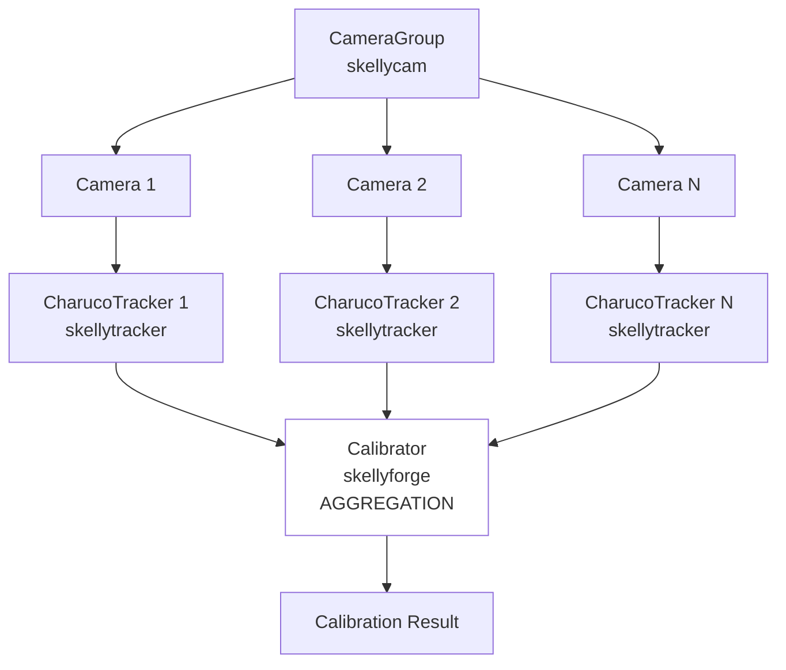
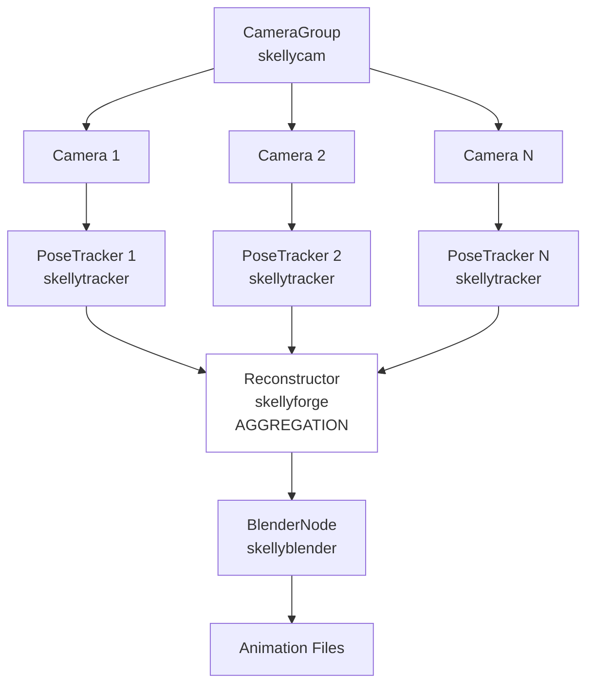

# FreeMoCap Architecture: Design Principles and Theoretical Foundations
> [!Caution] 
> This is an AI generated document from a chat between JSM and Claude-sonnet-4.5 on 2025-10-08
> It captures the main ideas and nicely academically grounds the concepts in established software architecture theory, but obviously gets some of the details wrong
>
> tldr - AI generated document, expect wonk

## Executive Summary

FreeMoCap employs a **polyrepo dataflow graph architecture** inspired by ROS2's computation graph model, where the core repository orchestrates processing graphs composed of independently developed domain-specific sub-repositories. This document establishes the theoretical foundations and design principles guiding FreeMoCap's architectural decisions, providing a framework for consistent development across all repositories.

The architecture follows the **pipes-and-filters** pattern from classical software architecture (Garlan & Shaw, 1993), implemented using modern directed acyclic graph (DAG) concepts. Nodes represent processing components (filters), edges represent data flow (pipes), and the resulting dataflow graphs enable visual processing pipelines where data transforms through successive stages.

## Architecture Overview

### System Structure

FreeMoCap v2 is organized as a **dataflow graph architecture** where:

- **Core Repository** (`freemocap/freemocap`): Defines and executes processing graphs composed of nodes from sub-skelly repositories
- **Sub-Skelly Repositories**: Independent, domain-bounded modules that expose processing capabilities
  - `skellycam`: Camera/video handling, empirical measurement, raw data generation
  - `skellytracker`: Single-camera image tracking and computer vision
  - `skellyforge`: Multi-camera data aggregation and 3d reconstruction
  - `skellyblender`: Animation output generation (.blend, .bvh, .fbx, .gltf)

Each processing graph is a directed acyclic graph (DAG) where **nodes** perform processing operations (filters) and **edges** represent data flowing between them (pipes). This follows the classical **pipes-and-filters** architectural pattern, where visual processing is conceptualized as data flowing through successive transformations - raw images → detected features → 3d points → animated skeleton.

### Primary Processing Graphs

FreeMoCap defines several graph topologies for different workflows. Each graph specifies nodes and edges at design time; data streams flow through the graph at runtime.

#### 1. Calibration Pipeline

**Topology**: Fan-in aggregation with parallel per-camera processing



**Data Flow**:
- CameraGroup produces synchronized images (one per camera per frame)
- Each camera's images flow to its dedicated CharucoTracker
- Each tracker detects charuco board corners independently (parallel processing)
- All detected points converge at Calibrator (synchronization point)
- Calibrator aggregates multi-camera observations to compute intrinsic/extrinsic parameters

**Key Characteristics**:
- **Parallel Processing**: Camera1→Tracker1 runs simultaneously with Camera2→Tracker2 (no edges between them)
- **Synchronization Point**: Forge waits for ALL trackers before processing
- **Aggregation**: Many inputs (N cameras) → One output (calibration parameters)

#### 2. Motion Capture Pipeline

**Topology**: Fan-in aggregation with parallel per-camera processing (same pattern, different nodes)



**Data Flow**:
- CameraGroup produces synchronized images from all cameras
- Each camera's images flow to its dedicated PoseTracker
- Each tracker detects body landmarks independently (parallel processing)
- All 2D landmarks converge at Reconstructor (synchronization point)
- Reconstructor triangulates multi-camera 2D observations into 3D points
- 3D point sequences flow to BlenderNode for animation generation
- Final outputs: .blend, .bvh, .fbx, .gltf files

**Key Characteristics**:
- Same fan-in aggregation topology as calibration
- Different processing at each node type
- Different data flowing through edges (pose landmarks vs charuco corners)
- Calibration parameters from calibration pipeline enter as INPUT to Reconstructor node

#### 3. Aggregation Pattern: Scatter-Gather

Both pipelines follow a **scatter-gather** pattern common in distributed systems:

**Scatter Phase**: 
- CameraGroup distributes images to multiple parallel trackers
- Each tracker processes independently (MapReduce "Map" phase)

**Gather Phase**: 
- SkellyForge aggregates results from all trackers (MapReduce "Reduce" phase)
- Synchronization: waits for ALL inputs before processing
- Combines N parallel streams into unified output

This is more sophisticated than linear pipelines. It's the same pattern used by:
- Apache Spark (parallel map operations → reduce)
- ROS2 multi-sensor fusion
- Distributed rendering systems (render tiles in parallel → composite)

#### 4. Graph Configuration Variations

The same topology can execute differently based on configuration:

- **Real-Time Mode**: Nodes use "read latest" strategy, skip frames to minimize latency
- **Post-Hoc Mode**: Nodes use "read next" strategy, process every frame for accuracy
- **Custom Pipelines**: Add nodes for face tracking, segmentation, filtering, etc.

The graph topology (nodes + edges) stays the same; runtime behavior changes through node configuration.

## Theoretical Foundations

### 1. Dataflow Graph Architecture (Garlan & Shaw, 1993)

**Source**: David Garlan and Mary Shaw, "An Introduction to Software Architecture," Advances in Software Engineering and Knowledge Engineering, Volume 1, World Scientific Publishing, 1993. Also published as CMU Technical Report CMU-CS-94-166.

FreeMoCap implements a **dataflow graph architecture** based on the classical **pipes-and-filters** pattern. In modern practice (2024-2025), these systems are typically described as directed acyclic graphs (DAGs) - used by Apache Airflow, Apache Spark, ROS2, and modern ML pipelines. The underlying architectural principles remain those established by Garlan and Shaw.

**Terminology mapping**:
- Classical: Pipes-and-Filters → Modern: Dataflow Graph / DAG
- Classical: Filters → Modern: Nodes
- Classical: Pipes → Modern: Edges
- Classical: Data Streams → Modern: Data Flow

The pipes-and-filters metaphor remains valuable for conceptual understanding, particularly in visual processing: raw images flow through successive filters (feature detection, tracking, triangulation) like light through optical filters in a lens system.

#### Terminology: Dataflow Graphs, DAGs, and Pipes-and-Filters

Modern systems describe this architecture using **directed acyclic graph (DAG)** terminology (nodes and edges) rather than pipes-and-filters, though the underlying principles remain identical. Systems like Apache Airflow, Apache Spark, and ROS2 all use DAG-based dataflow architectures. FreeMoCap uses "dataflow graph" as the primary term while acknowledging its roots in pipes-and-filters theory.

The pipes-and-filters metaphor is particularly apt for visual processing: raw pixel data flows through successive filters (edge detection, feature extraction, triangulation) much like light passes through optical filters in a camera lens.

#### Core Architecture: Nodes and Edges

FreeMoCap dataflow graphs consist of:

- **Nodes**: Processing operations implemented by sub-skelly repositories (e.g., `CameraNode`, `TrackerNode`, `ReconstructorNode`)
  
- **Edges**: Directed connections between nodes defining valid data flow paths
  - Implemented via shared memory buffers (for images) or message queues (for metadata)
  - Edges specify topology and data contracts, not data content
  
- **Data Streams** (runtime): Actual data flowing from node to node when the graph executes
  - Edges define *where* data can flow; streams are the *actual* data flowing
  - Streams only exist during execution

**Key Insight**: Graph structure (nodes + edges) is defined once at design time. Data streams emerge dynamically each time you execute the graph.

#### Core Invariants Applied to FreeMoCap

Garlan and Shaw define four essential invariants for dataflow architectures. FreeMoCap adheres to these principles:

Garlan and Shaw define four essential invariants for dataflow architectures:

1. **Node Independence**: "Filters must be independent entities that do not share state with other filters"
   - **FreeMoCap Application**: Sub-skelly repositories maintain no shared state; all communication happens through explicit data passing at edges
   - **Implementation**: Each sub-skelly can be developed, tested, and deployed independently
   - **At Runtime**: When data streams flow, nodes process data without side-effects visible to other nodes

2. **Identity Ignorance**: "Filters are ignorant of the identity of their upstream and downstream filters"
   - **FreeMoCap Application**: Sub-skelly components expose generic interfaces; they do not know what other components will consume their outputs or provide their inputs
   - **Implementation**: `skellytracker` produces tracking data without knowing whether `skellyforge` or a visualization tool will consume it
   - **At Runtime**: Nodes process data from edges without querying "who sent this?"

3. **Order Independence**: "The correctness of the output cannot depend on the order in which filters process data"
   - **FreeMoCap Application**: The graph topology defines valid execution order through its edge structure. Nodes without edges between them can execute in any order or in parallel.
   - **Implementation**: Camera1→Tracker1 and Camera2→Tracker2 have no edges between them, so they can run simultaneously. However, you cannot triangulate without 2D tracking data because the graph topology prevents it - there's no edge path that allows it.
   - **Within-Graph Order**: The graph structure itself encodes dependencies. Our pre-defined graphs make invalid compositions impossible by construction.
   - **Cross-Graph Order**: Separate graphs may have temporal dependencies (calibration must happen before mocap), but calibration data enters mocap as a parameter/input, not as a node in the same graph. This is workflow sequencing, not graph topology.
   - **At Runtime**: Independent branches (no connecting edges) process in parallel; dependent sequences (connected by edges) process in order

4. **Passive Edges**: "Pipes serve purely as conduits for data streams, not as active processing components"
   - **FreeMoCap Application**: Communication mechanisms (shared memory buffers, message queues) perform no data transformation
   - **Implementation**: Image buffers and message queues transmit data unchanged; all processing happens in nodes
   - **At Runtime**: When data flows along an edge, the edge itself doesn't modify the data

#### Key Advantages for FreeMoCap

From Garlan and Shaw's analysis, dataflow graph architectures provide:

- **Compositional Understanding**: System behavior emerges from individual node behaviors connected by edges. Understanding calibration means understanding CameraGroup + CharucoTracker + Calibrator in sequence, plus the fan-in aggregation pattern.

- **Parallel Execution**: Independent nodes run concurrently. Camera1→Tracker1 and Camera2→Tracker2 execute simultaneously because there are no edges between them. This is essential for multi-camera systems.

- **Reusability**: Any two nodes can connect if their edge contract agrees on data format. We can swap MediapipeTracker for OpenPoseTracker without changing the graph topology.

- **Easy Maintenance**: Nodes can be replaced or enhanced without affecting others, as long as they maintain their edge contracts (input/output data formats).

- **Specialized Analysis**: Clear edge boundaries enable performance measurement. We can measure latency at each edge, identify bottlenecks (often at aggregation nodes), and optimize specific nodes.

- **Visual Clarity**: Graph structure can be visualized (similar to ROS2's rqt_graph), making system behavior comprehensible even to non-programmers. The fan-in pattern visually shows where synchronization happens.

#### Aggregation and Synchronization Patterns

FreeMoCap's multi-camera topology introduces important patterns beyond simple linear pipelines:

**Fan-In Aggregation**: 
- Multiple upstream sources (N cameras) converge at a single downstream consumer (SkellyForge)
- Common in multi-sensor systems, distributed rendering, parallel data processing
- Garlan and Shaw: "Pipes can split or synchronize the data flow"

**Synchronization Points**:
- Aggregation nodes (SkellyForge) must wait for input from ALL upstream sources
- Cannot triangulate 3D points until ALL cameras have produced 2D landmarks for a given frame
- Synchronization happens at edges: the aggregation node's input edges define what it waits for

**Scatter-Gather (MapReduce-style)**:
- **Scatter**: CameraGroup distributes images to parallel trackers (Map phase)
- **Gather**: SkellyForge collects and combines tracker outputs (Reduce phase)
- Same pattern used by Apache Spark, Hadoop MapReduce, distributed systems

**Implications**:
- Performance bottleneck likely at aggregation nodes (must wait for slowest upstream)
- Failure handling requires policy: wait for all? Proceed with subset? Timeout?
- Load balancing matters: uneven camera processing times delay aggregation

This is more sophisticated than simple linear dataflow and connects FreeMoCap to distributed systems theory.

#### Acknowledged Trade-offs

Garlan and Shaw document disadvantages that FreeMoCap must manage:

- **Batch Tendency**: "Systems frequently degenerate to batch organization despite incremental processing capabilities"
  - **FreeMoCap Mitigation**: Explicit distinction between real-time and post-hoc graph configurations. Real-time graphs configured to skip frames; post-hoc graphs configured to process all frames.

- **Interactive Limitations**: "Transformational character conflicts with incremental display updates"
  - **FreeMoCap Mitigation**: UI is separate concern, not embedded in dataflow pipelines. Graphs produce outputs; UI consumes outputs asynchronously.

- **Data Format Overhead**: "Data transmission forces expensive parsing/unparsing in each filter"
  - **FreeMoCap Mitigation**: 
    - Shared memory for large data (images) - zero-copy passing between nodes
    - Structured formats (numpy arrays, dataclasses) for metadata - efficient serialization
    - Keep data transformations at edges minimal; most processing happens within nodes

- **Error Propagation**: Errors in one node can cascade through the graph, making debugging difficult
  - **FreeMoCap Mitigation**: Clear error boundaries at edges; nodes catch and report errors explicitly rather than allowing silent failure

**Key Insight**: These aren't limitations of dataflow graphs per se, but engineering challenges that require conscious design decisions. The architecture provides the structure; we must implement it thoughtfully.

### 2. Information Hiding (Parnas, 1972)

**Source**: David L. Parnas, "On the Criteria To Be Used in Decomposing Systems into Modules," Communications of the ACM, Vol. 15, No. 12, December 1972, pp. 1053-1058.

#### Core Principle

"Every module is characterized by its knowledge of a design decision which it hides from all others. Its interface or definition was chosen to reveal as little as possible about its inner workings."

The primary criterion: "Begin with a list of difficult design decisions or design decisions which are likely to change. Each module is then designed to hide such a decision from the others."

#### Application to FreeMoCap Architecture

Each sub-skelly repository hides specific design decisions:

**SkellyCam Hides**:
- Camera hardware interface details
- Video codec implementations
- Synchronization mechanisms
- Frame buffer management strategies

**SkellyTracker Hides**:
- Specific tracking algorithm implementations (MediaPipe, OpenPose, etc.)
- Model loading and inference details
- Coordinate system transformations
- Confidence score calculations

**SkellyForge Hides**:
- 3d reconstruction algorithms
- Triangulation methods
- Gap-filling strategies
- Coordinate system conventions

**SkellyBlender Hides**:
- .blend file format details
- Animation export implementations
- Rendering pipeline specifics
- File format conversions

#### Key Benefit: Change Isolation

Parnas demonstrated that changes to hidden design decisions remain confined to single modules. For FreeMoCap:

- Switching tracking algorithms (MediaPipe → OpenPose) requires changes only to `skellytracker`
- Changing camera synchronization strategy requires changes only to `skellycam`
- Modifying 3d reconstruction approach requires changes only to `skellyforge`

#### Design Rules from Parnas

1. "Data structures, their internal linkings, accessing procedures, and modifying procedures must belong to the same module"
   - **FreeMoCap Application**: Each sub-skelly owns its data structures completely

2. "The sequence of control should be hidden within a module as far as is possible"
   - **FreeMoCap Application**: Processing logic remains internal; only inputs/outputs are exposed

3. "One should begin by listing likely changes, not by defining the processing sequence"
   - **FreeMoCap Application**: Domain boundaries based on likely-to-change decisions, not algorithmic steps

### 3. Bounded Contexts (Evans, 2003)

**Source**: Eric Evans, "Domain-Driven Design: Tackling Complexity in the Heart of Software," Addison-Wesley, 2003, Part IV: Strategic Design.

#### Definition

"A Bounded Context is a semantic boundary where domain concepts have specific, internally consistent meanings." Multiple contexts may use the same terms with different meanings.

#### Application to FreeMoCap Sub-Skellies

Each sub-skelly represents a distinct bounded context:

**SkellyCam Context**: "Frame" means raw image data from a camera at a specific timestamp
**SkellyTracker Context**: "Frame" means processed image with detected landmarks
**SkellyForge Context**: "Frame" means synchronized multi-camera observations at a time point
**Core FreeMoCap Context**: "Frame" means a node in the processing graph

These different meanings are intentional and correct within each context. The boundaries make ambiguity explicit rather than hidden.

#### Context Mapping Patterns

From Evans's Strategic Design patterns, FreeMoCap employs:

**Open Host Service (OHS)**: Each sub-skelly exposes a well-defined protocol/API
- Sub-skellies publish clear interfaces that core FreeMoCap consumes
- Interfaces designed for stability across versions

**Published Language**: Shared data formats across contexts
- Standardized message schemas for inter-component communication
- Common coordinate system definitions where necessary

**Customer-Supplier**: Core FreeMoCap depends on sub-skelly capabilities
- Sub-skellies have obligations to maintain backward compatibility
- Core provides requirements; sub-skellies deliver capabilities

### 4. Quality Attributes as Architectural Drivers (Bass et al., 2021)

**Source**: Len Bass, Paul Clements, Rick Kazman, "Software Architecture in Practice," 4th Edition, Addison-Wesley, 2021.

#### Core Principle

"While functionality is largely independent of structure, quality attributes are not. Architecture is the first and primary place where quality attributes can be addressed."

#### FreeMoCap's Architectural Quality Attributes

**Modifiability**: The ease with which changes can be made
- **Scenario**: Developer needs to add new tracking algorithm
- **Response**: Changes confined to `skellytracker` repository only
- **Measure**: Number of affected repositories (target: 1)

**Teachability/Understandability** (Usability sub-characteristic):
- **Scenario**: New contributor needs to understand camera handling
- **Response**: Can study `skellycam` repository in isolation
- **Measure**: Time to comprehension without reading other repositories

**Reusability**:
- **Scenario**: External project needs camera synchronization
- **Response**: Can use `skellycam` standalone without FreeMoCap core
- **Measure**: Feasibility of standalone usage (target: yes with minimal utility code)

**Testability**:
- **Scenario**: Developer needs to verify tracking accuracy
- **Response**: Can test `skellytracker` with recorded inputs
- **Measure**: Ability to test components independently (target: 100% of sub-skellies)

#### Architectural Tactics Applied

From Bass's taxonomy of architectural tactics:

**For Modifiability**:
- **Increase Cohesion**: Group related functionality within single repositories
- **Reduce Coupling**: Minimize dependencies between repositories
- **Defer Binding**: Use configuration and plugin patterns for component selection

**For Teachability**:
- **Semantic Coherence**: Each repository has single, clear purpose
- **Encapsulation**: Hide complexity behind simple interfaces
- **Use of Intermediaries**: Core provides abstraction layer over sub-skellies

### 5. Polyglot Architecture (Ford, 2006; Fowler, 2011)

**Sources**: 
- Neal Ford, "Polyglot Programming," Meme Agora blog, December 2006
- Martin Fowler, "Polyglot Persistence," martinfowler.com, November 2011

#### Core Principle

Complex systems benefit from heterogeneous technology stacks, using "the right tool for each job" rather than forcing all problems into one solution.

#### Application to FreeMoCap

While FreeMoCap uses Python throughout (homogenous language), it employs **polyglot architecture** in the conceptual sense:

**Multiple Architectural Styles**:
- Object-oriented (within sub-skellies)
- Dataflow (between sub-skellies)
- Event-driven (for UI updates)

**Multiple Domains**:
- Hardware interaction (`skellycam`)
- Computer vision (`skellytracker`)
- Computational geometry (`skellyforge`)
- 3D graphics (`skellyblender`)

**Domain-Specific Abstractions**:
Each sub-skelly uses abstractions natural to its domain rather than forcing common patterns

#### Key Benefit: Optimal Abstractions Per Domain

From Fowler: "We're first asking how we want to manipulate the data and only then figuring out what technology is the best bet for it."

FreeMoCap applies this by asking "what is the natural abstraction for this domain?" before imposing structure.

## Design Principles for FreeMoCap Architecture

### Principle 1: Domain-Driven Repository Boundaries

**Statement**: Repository boundaries follow domain boundaries, not technical layers or processing steps.

**Rationale**: Parnas's information hiding principle states that modules should hide design decisions likely to change. Domain concepts change independently—camera technology evolves separately from tracking algorithms.

**Rules**:
1. Each sub-skelly represents a distinct bounded context with its own ubiquitous language
2. Sub-skellies do not depend on other sub-skellies (no cross-imports)
3. Boundaries chosen to isolate likely-to-change design decisions

**Example**: `skellytracker` and `skellyforge` are separate despite both doing "processing" because tracking algorithms and reconstruction algorithms evolve independently.

### Principle 2: Dataflow Graph Orchestration

**Statement**: Core FreeMoCap's responsibility is graph topology definition and execution, not domain logic.

**Rationale**: Garlan and Shaw's dataflow architecture separates node implementation (filters) from connectivity (pipes). Core owns the "wiring diagram," sub-skellies own the processing.

**Rules**:
1. Core defines processing graphs as directed acyclic graphs (DAG nodes and edges)
2. Sub-skellies provide node implementations (processing filters)
3. Graphs specify data flow topology, not processing algorithms
4. Multiple graph types exist for different workflows (calibration, capture, post-processing)

**Example**: Calibration graph connects `skellycam.CameraGroup` → `skellytracker.CharucoTracker` → `skellyforge.Calibrator`. Core knows the topology; components know the processing.

### Principle 3: Minimal Interface Exposure

**Statement**: Sub-skellies expose only what core FreeMoCap needs to use them; all else remains hidden.

**Rationale**: Parnas: "Interfaces should be chosen to reveal as little as possible about inner workings." Smaller interface = more freedom to change implementation.

**Rules**:
1. Public APIs documented as contracts
2. Internal implementation details kept private
3. No exposure of data structures used internally
4. Version interfaces to maintain backward compatibility

**Example**: `skellycam` exposes a `CameraGroup` interface providing synchronized frames. How synchronization works (hardware triggers, timestamps, etc.) remains hidden.

### Principle 4: Standalone Viability

**Statement**: Each sub-skelly must function standalone for its domain without requiring FreeMoCap core.

**Rationale**: Supports teachability (study one component at a time), reusability (use in other projects), and testability (test independently).

**Rules**:
1. Each sub-skelly includes a simple standalone demo/interface
2. Sub-skellies do not import `freemocap` or other sub-skellies
3. Utility functions for standalone operation implemented locally
4. Documentation shows standalone usage

**Example**: `skellytracker` provides a webcam demo showing tracking output without needing `skellycam` or `freemocap` core.

### Principle 5: Clear Data Contracts at Edges

**Statement**: Data passed between nodes must have well-defined, versioned schemas specified at the edges.

**Rationale**: Garlan and Shaw: "Any two filters can connect if they agree on data formats." Edges define the contract; data streams must conform to it.

**Rules**:
1. Document data formats that can flow across each edge type
2. Use structured types (dataclasses, typed arrays) not arbitrary dictionaries
3. Version data formats when making incompatible changes
4. Define coordinate systems, units, and conventions explicitly at edges
5. Edge contracts are independent of how nodes produce/consume data internally

**Example**: The edge from `TrackerNode` to `ReconstructorNode` specifies:
- Data type: `TrackedFrame` (2D landmarks with confidence scores)
- Coordinate system: Pixel coordinates (origin top-left)
- Units: Pixels, normalized confidence [0.0, 1.0]
- Structure: `dict[landmark_name: str, point: tuple[float, float], confidence: float]`

How `skellytracker` internally computes these landmarks is hidden. How `skellyforge` internally uses them is hidden. The edge contract is all that matters for connecting the two nodes.

### Principle 6: Educational Accessibility

**Statement**: Architecture optimizes for understandability by novice developers and students, not just experts.

**Rationale**: Bass et al.'s quality attributes framework treats teachability/understandability as architectural drivers. FreeMoCap is inherently an educational tool.

**Rules**:
1. Each repository is comprehensible in isolation
2. Concepts build progressively (camera → tracking → reconstruction)
3. Documentation targets multiple expertise levels
4. Clear visual representations of what each component does

**Example**: Repository READMEs include visualizations of inputs/outputs, making component purpose immediately clear.

### Principle 7: No Conformist Dependencies

**Statement**: Core FreeMoCap does not blindly conform to whatever interfaces sub-skellies expose; it defines its own domain model.

**Rationale**: Evans's strategic design warns against "conformist" relationships where downstream uncritically accepts upstream's model. This creates tight coupling.

**Rules**:
1. Core defines its own abstractions for motion capture concepts
2. Adapters translate between core's model and sub-skelly interfaces
3. Sub-skelly changes should not force core refactoring
4. Anti-corruption layers protect core from upstream changes

**Example**: Core defines a `MotionCaptureSession` abstraction; adapters translate between this and specific tracker outputs.

## Sub-Skelly Integration Pattern: The Adapter Approach

### How Sub-Skellies Expose Themselves to Core

Sub-skellies **do not** expose Node objects or have any knowledge of FreeMoCap's dataflow graph runtime. Instead, they expose simple, domain-focused interfaces that core FreeMoCap wraps using the **Adapter Pattern**.

#### The Adapter Pattern

**Core Principle**: Sub-skellies remain ignorant of how they'll be used in dataflow graphs. Core FreeMoCap creates adapter objects that translate between sub-skelly interfaces and graph node requirements.

```python
# Sub-skelly exposes simple interface (does not know about graphs/nodes)
class MediapipeTracker:
    def process_frame(self, image: np.ndarray) -> TrackedFrame:
        """Process single image, return tracking results."""
        # Implementation details hidden
        
# Core creates adapter wrapping sub-skelly in a Node
class TrackerNode(GraphNode):
    def __init__(self, tracker: MediapipeTracker):
        self._tracker = tracker  # Composition, not inheritance
        
    def execute(self, input_data: NodeInput) -> NodeOutput:
        """Node execution called by graph runtime."""
        image = input_data.get_image()
        tracked = self._tracker.process_frame(image)  # Delegate to sub-skelly
        return NodeOutput(tracked_frame=tracked)
```

#### Why This Approach?

This follows our architectural principles:

1. **Information Hiding (Parnas)**: Sub-skellies hide the design decision "how does graph runtime work?" They don't need to know.

2. **Standalone Viability (Principle 4)**: Sub-skellies can be used without FreeMoCap core because they have no dependency on graph infrastructure.

3. **No Conformist Dependencies (Principle 7)**: Core defines its own node abstraction and adapts sub-skellies to it, rather than conforming to whatever interface sub-skellies happen to expose.

4. **Anti-Corruption Layer (Evans)**: Adapters protect core from changes in sub-skelly interfaces and vice versa.

#### Integration Contract

Sub-skellies must provide:
- **Simple functional interfaces**: Methods that take inputs and return outputs
- **Clear data contracts**: Documented input/output types
- **Stateless processing where possible**: Or explicit state management interfaces

Core provides:
- **Adapter implementations**: Wrapping sub-skelly functionality as graph nodes
- **Graph runtime**: Scheduling, data routing, error handling
- **Integration layer**: Translating between core's abstractions and sub-skelly interfaces

**Example**: Core defines a `MotionCaptureSession` abstraction; adapters translate between this and specific tracker outputs.

## Sub-Skelly Definition Schema

Each sub-skelly repository should define its role using the following schema. This ensures consistent understanding across the FreeMoCap ecosystem.

### Sub-Skelly Definition Template

```yaml
# Repository: skellycam
name: SkellyCam
domain: Camera/Video Hardware and Synchronization
responsibility: Synchronized multi-camera image acquisition

# What design decisions does this sub-skelly HIDE?
hidden_design_decisions:
  - Camera driver and hardware interface details
  - Synchronization mechanism (hardware triggers vs software timestamps)
  - Frame buffer implementation and memory management
  - Video codec and compression details
  - Camera calibration parameter storage format

# What interfaces does this sub-skelly EXPOSE?
exposed_interfaces:
  - name: CameraGroup
    purpose: Manage multiple synchronized cameras
    key_methods:
      - get_synchronized_frames() -> dict[CameraId, Frame]
      - start_recording()
      - stop_recording()
    
  - name: VideoReader  
    purpose: Read pre-recorded synchronized videos
    key_methods:
      - read_frame(frame_number: int) -> dict[CameraId, Frame]
      - get_frame_count() -> int

# What data does this sub-skelly PRODUCE?
output_data:
  - type: Frame
    description: Single camera image with metadata
    fields:
      - image: numpy array (H, W, 3) uint8
      - timestamp: float (seconds)
      - camera_id: str
      - frame_number: int
      
  - type: SynchronizedFrameSet
    description: Time-aligned frames from multiple cameras
    fields:
      - frames: dict[CameraId, Frame]
      - sync_timestamp: float

# What data does this sub-skelly CONSUME?
input_data:
  - type: CameraConfig
    description: Camera settings and calibration
  - type: RecordingPath
    description: Path to recorded video files

# What are the BOUNDARIES (what this sub-skelly does NOT do)?
does_not_do:
  - Does NOT perform image analysis or feature detection
  - Does NOT handle multi-camera triangulation or reconstruction
  - Does NOT provide tracking or pose estimation
  - Does NOT generate animation outputs
  
# How does this integrate with core FreeMoCap?
integration_points:
  adapter_location: freemocap.core.adapters.camera_adapter
  node_types:
    - CameraSourceNode: Wraps CameraGroup for real-time capture
    - VideoSourceNode: Wraps VideoReader for post-hoc processing

# Standalone demonstration
standalone_demo:
  command: python -m skellycam.demo
  description: Simple multi-camera recorder with live preview
```

### Schema Guidelines

When defining a sub-skelly:

1. **Hidden Design Decisions**: List concrete implementation choices that could change without affecting users. These are what Parnas tells us to hide.

2. **Exposed Interfaces**: Document only the public APIs that core FreeMoCap (or other users) should depend on. Be minimal - expose only what's necessary.

3. **Output Data**: Define precise data structures with explicit types. These are your "published language" (Evans) - the contract between contexts.

4. **Input Data**: What dependencies does this sub-skelly have? Keep these minimal to maximize reusability.

5. **Boundaries**: Explicitly state what this sub-skelly does NOT do. This prevents scope creep and clarifies domain boundaries.

6. **Integration Points**: How does core FreeMoCap wrap this sub-skelly? Where do adapters live?

### Example: SkellyTracker Definition

```yaml
name: SkellyTracker
domain: Single-Camera Image Analysis
responsibility: Detect and track features in individual camera images

hidden_design_decisions:
  - Specific tracking algorithm implementations (MediaPipe, OpenPose, etc.)
  - Model loading and initialization strategies
  - Inference optimization (batching, GPU usage)
  - Internal coordinate system transformations

exposed_interfaces:
  - name: Tracker (Abstract Base)
    purpose: Common interface for all tracking algorithms
    key_methods:
      - process_frame(image: ndarray) -> TrackedFrame
      - get_landmark_names() -> list[str]
      
  - name: MediapipeTracker (Concrete)
  - name: CharucoTracker (Concrete)

output_data:
  - type: TrackedFrame
    description: Image with detected landmarks
    fields:
      - landmarks: dict[str, Point2D]  # landmark_name -> (x, y)
      - confidences: dict[str, float]
      - source_image_shape: tuple[int, int]

input_data:
  - type: Image (numpy.ndarray)
  - type: TrackerConfig (model selection, confidence thresholds)

does_not_do:
  - Does NOT handle camera synchronization or multi-camera data
  - Does NOT perform 3d reconstruction or triangulation  
  - Does NOT generate animation outputs
  - Does NOT manage camera hardware

integration_points:
  adapter_location: freemocap.core.adapters.tracking_adapter
  node_types:
    - TrackingNode: Wraps Tracker for per-camera processing in graph
```

## Architectural Invariants

These rules must never be violated:

### Invariant 1: No Circular Dependencies
Sub-skelly A must never depend on sub-skelly B. All dependencies flow toward core FreeMoCap.

### Invariant 2: Single Responsibility Per Repository
Each repository has exactly one reason to change (one domain concern).

### Invariant 3: Interface Stability
Public interfaces must maintain backward compatibility across minor versions.

### Invariant 4: Explicit Data Flow
All communication between components happens through explicit data passing; no shared mutable state.

### Invariant 5: Domain Purity
Sub-skellies contain only domain logic for their bounded context; infrastructure code lives in core.

## Repository Responsibilities

Each repository's role is formally defined using the Sub-Skelly Definition Schema (see above). Below are high-level summaries:

### Core FreeMoCap (`freemocap/freemocap`)

**Domain**: Motion capture workflow orchestration

**Responsibilities**:
- Define dataflow graph structures (calibration, capture, post-processing graphs)
- Implement graph runtime (node scheduling, data routing, execution)
- Provide adapters translating between sub-skelly interfaces and graph nodes
- Handle cross-cutting concerns (configuration, logging, error handling)
- Define core motion capture domain model

**Integration Approach**: Creates adapter nodes wrapping sub-skelly components. For example, `CameraSourceNode` wraps `skellycam.CameraGroup`, `TrackingNode` wraps `skellytracker.Tracker`, etc.

**Does NOT**:
- Implement camera interfaces
- Implement tracking algorithms
- Implement reconstruction algorithms
- Implement rendering/export

For detailed sub-skelly definitions, see the Sub-Skelly Definition Schema section above. Each sub-skelly repository should maintain its definition in a `ARCHITECTURE.yaml` or `DEFINITION.yaml` file in its root directory.

### Core FreeMoCap (`freemocap/freemocap`)

**Domain**: Motion capture workflow orchestration

**Responsibilities**:
- Define processing graph structures (calibration, capture, post-processing)
- Manage graph execution (node scheduling, data routing)
- Provide anti-corruption layers adapting between sub-skellies
- Handle cross-cutting concerns (configuration, logging, error handling)
- Define core motion capture domain model

**Does NOT**:
- Implement camera interfaces
- Implement tracking algorithms
- Implement reconstruction algorithms
- Implement rendering/export

### Sub-Skelly Repositories

For detailed definitions of each sub-skelly's responsibilities, hidden design decisions, exposed interfaces, and boundaries, see the Sub-Skelly Definition Schema section above. Each sub-skelly repository maintains its formal definition in an `ARCHITECTURE.yaml` file in its root directory.

Summary of sub-skelly domains:
- **SkellyCam**: Camera/video hardware and synchronization
- **SkellyTracker**: Single-camera image analysis and tracking
- **SkellyForge**: Multi-camera data aggregation and 3d reconstruction
- **SkellyBlender**: Animation generation and export

## Implementation Guidance

### When Creating Adapters (Core FreeMoCap)

Adapters live in `freemocap.core.adapters` and wrap sub-skelly functionality as graph nodes:

1. **Import sub-skelly interface**: `from skellytracker import MediapipeTracker`
2. **Create adapter node class**: Inherits from `GraphNode` or similar base class
3. **Compose, don't inherit**: Adapter contains sub-skelly instance, doesn't extend it
4. **Translate data formats**: Convert between core's data model and sub-skelly's
5. **Handle errors gracefully**: Catch sub-skelly exceptions and translate to graph-level errors
6. **Document the adaptation**: Explain what transformations happen in the adapter

Example adapter structure:
```python
class TrackingAdapter(GraphNode):
    """Adapts skellytracker.Tracker to FreeMoCap graph node."""
    
    def __init__(self, tracker: Tracker):
        self._tracker = tracker  # Composition
        
    def execute(self, inputs: NodeInputs) -> NodeOutputs:
        # Translate core format → sub-skelly format
        image = inputs.get_image()
        
        # Delegate to sub-skelly
        tracked = self._tracker.process_frame(image)
        
        # Translate sub-skelly format → core format  
        return NodeOutputs(landmarks=self._adapt_landmarks(tracked))
```

### When Designing New Components

1. **Identify the domain boundary**: What design decisions does this component hide?
2. **Define the minimal interface**: What must external users know? Hide everything else.
3. **Ensure standalone viability**: Can this work without FreeMoCap core?
4. **Document data contracts**: What formats flow in and out?
5. **Create visual explanations**: What does this component do? Show it.

### When Modifying Interfaces

1. **Maintain backward compatibility**: Add, don't change or remove
2. **Version breaking changes**: Use semantic versioning
3. **Update all documentation**: Keep contracts current
4. **Test cross-boundary impacts**: Verify dependent components still work

### When Adding Dependencies

1. **Challenge the need**: Does this violate repository independence?
2. **Keep dependencies minimal**: Fewer dependencies = more freedom
3. **Depend on abstractions**: Interfaces, not implementations
4. **Document dependency rationale**: Why is this necessary?

## References

### Core Sources

**Garlan, D., & Shaw, M. (1993)**. An Introduction to Software Architecture. In *Advances in Software Engineering and Knowledge Engineering*, Volume 1. World Scientific Publishing. Also published as CMU Technical Report CMU-CS-94-166.
- **Key Contribution**: Formal definition of dataflow architectures and pipes-and-filters pattern

**Parnas, D. L. (1972)**. On the Criteria To Be Used in Decomposing Systems into Modules. *Communications of the ACM*, 15(12), 1053-1058.
- **Key Contribution**: Information hiding principle and criteria for module decomposition

**Evans, E. (2003)**. *Domain-Driven Design: Tackling Complexity in the Heart of Software*. Addison-Wesley. Part IV: Strategic Design.
- **Key Contribution**: Bounded contexts and context mapping patterns

**Bass, L., Clements, P., & Kazman, R. (2021)**. *Software Architecture in Practice* (4th ed.). Addison-Wesley.
- **Key Contribution**: Quality attributes as architectural drivers, quality attribute scenarios

**Ford, N. (2006)**. Polyglot Programming. Meme Agora blog. Retrieved from nealford.com
- **Key Contribution**: Using multiple languages/paradigms within single systems

**Fowler, M. (2011)**. Polyglot Persistence. Retrieved from martinfowler.com/bliki/PolyglotPersistence.html
- **Key Contribution**: Using multiple data storage technologies based on use case characteristics

### Supporting Sources

**Martin, R. C. (2017)**. *Clean Architecture: A Craftsman's Guide to Software Structure and Design*. Prentice Hall.
- **Relevant Concepts**: Dependency Rule, architectural boundaries

**Vernon, V. (2013)**. *Implementing Domain-Driven Design*. Addison-Wesley.
- **Relevant Concepts**: Operationalizing strategic design patterns

**Newman, S. (2021)**. *Building Microservices* (2nd ed.). O'Reilly Media.
- **Relevant Concepts**: Information hiding in microservices, independent deployability

## Conclusion

FreeMoCap's architecture synthesizes established software architecture principles—dataflow graph processing with aggregation patterns, information hiding, bounded contexts, quality-driven design, and polyglot thinking—into a coherent system optimized for both professional capability and educational accessibility.

The core insight is that **architecture is about boundaries**: where to draw them, what they hide, what they expose, and how components interact across them. FreeMoCap draws these boundaries at domain seams, creating independent repositories that can be understood in isolation while composing into powerful processing graphs.

**The Dataflow Graph Model**: FreeMoCap uses fan-in aggregation topology (scatter-gather pattern) where parallel per-camera processing branches converge at synchronization points. This connects motion capture to distributed systems theory—the same patterns powering Apache Spark and ROS2 multi-sensor fusion enable our multi-camera processing.

**Design Principle**: Graph topology defines valid compositions. The pre-defined graphs make invalid orderings impossible by construction - you cannot triangulate without tracking data because there's no edge path allowing it.

This document should guide all architectural decisions across the FreeMoCap ecosystem. When in doubt, return to the principles:
- Does this decision respect domain boundaries? 
- Does it hide design decisions likely to change? 
- Does it maintain minimal interfaces at edges?
- Does it preserve standalone viability? 
- Does the graph structure clearly show data flow and synchronization points?

If yes, proceed. If no, reconsider.